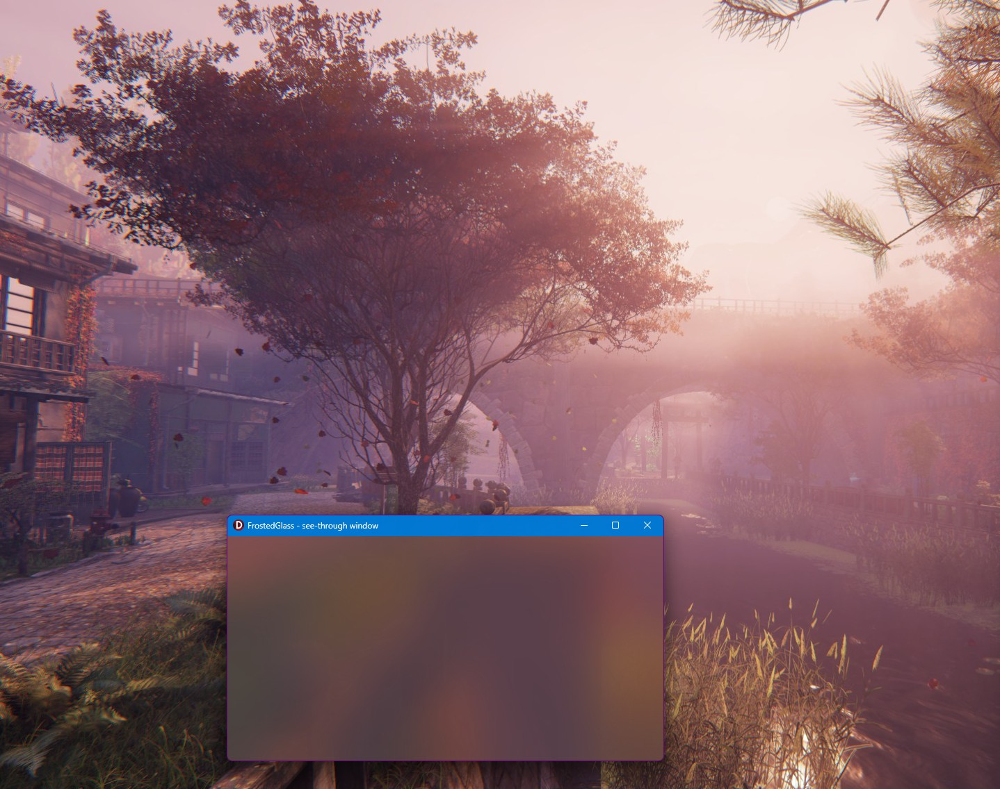

# FrostedGlass - Windows 11 frosted glass (Acrylic / Mica) on a Delphi VCL form

This demo puts the Windows 11 frosted-glass backdrop (Acrylic or Mica) on a Delphi VCL form and lets you see, live, how it gets along with VCL styles, dark mode and the standard controls.

It uses only the documented Windows 11 API [`DwmSetWindowAttribute(DWMWA_SYSTEMBACKDROP_TYPE)`](https://learn.microsoft.com/en-us/windows/win32/api/dwmapi/ne-dwmapi-dwmwindowattribute). No Windows.UI.Composition, no third-party components. It needs Windows 11 build 22621 or newer.

## What you can play with

- **Backdrop:** None, Auto, Mica, Acrylic, Mica Alt.
- **Extend frame into client area:** lets the glass show in the whole window, not only in the title bar.
- **Black client area:** GDI black is transparent on the glass.
- **Dark mode frame:** dark or light glass.
- **VCL style:** load any `.vsf` style from a `Styles` folder next to the EXE, and turn `seBorder` / `seClient` on and off.
- **White text** and **dark theme for check boxes and radio buttons**.
- **VCL GlassFrame:** the VCL's own glass support, as an alternative to "Extend frame".

A second window has no controls at all, so you can see the pure effect.

## What I found

This test  was written to decide whether the frosted look should go into [BioniX Wallpaper](https://www.bionixwallpaper.com), a wallpaper manager for Windows. BioniX's forms are full of controls, so the answer was no. The demo is public so you don't have to run the same experiment :)

Conlusions:  
- On an empty window (or the empty parts of a window) the effect looks great.
- On a form full of controls it is a fight. Labels, check boxes and radio buttons lose their captions (black text on black glass). White text fixes them, but then TEdit, TMemo and TListBox show white text on white, and TMemo / TListBox get black painting bars.

So: use it on a splash screen, an about box or a mostly empty window. Not on a busy form.

## Dependencies

[LightSaber](https://github.com/GabrielOnDelphi/Delphi-LightSaber) (free). Written with Delphi 13.

## License

Mozilla Public License 2.0 (MPL-2.0)
